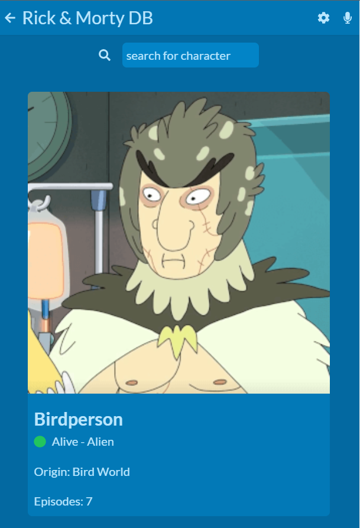

# Metrics Web App

> In this Project I built a React App that returns a list of 25 random Rick & Morty characters and their details. A user can search for characters in the search box and can hit refresh to reload the characters. The user can also click on the character card to view character details.

## Built With

- HTML
- CSS
- React
- Redux
- Rick & Morty API

## App Preview

## Live Demo

[Live Demo Link](https://rick-morty-db.netlify.app/)

## Authors

👤 **Paul Kaizirege Vedasto**

- GitHub: [@kaizipaul](https://github.com/kaizipaul)

## 🤝 Contributing

Contributions, issues, and feature requests are welcome!

Feel free to check the [issues page](../../issues/).

## Show your support

Give a ⭐️ if you like this project!

## Acknowledgments

- Microverse Inc.
- Nelson Sakwa from Behance.

## 📝 License

This project is [MIT](./LICENSE) licensed.
